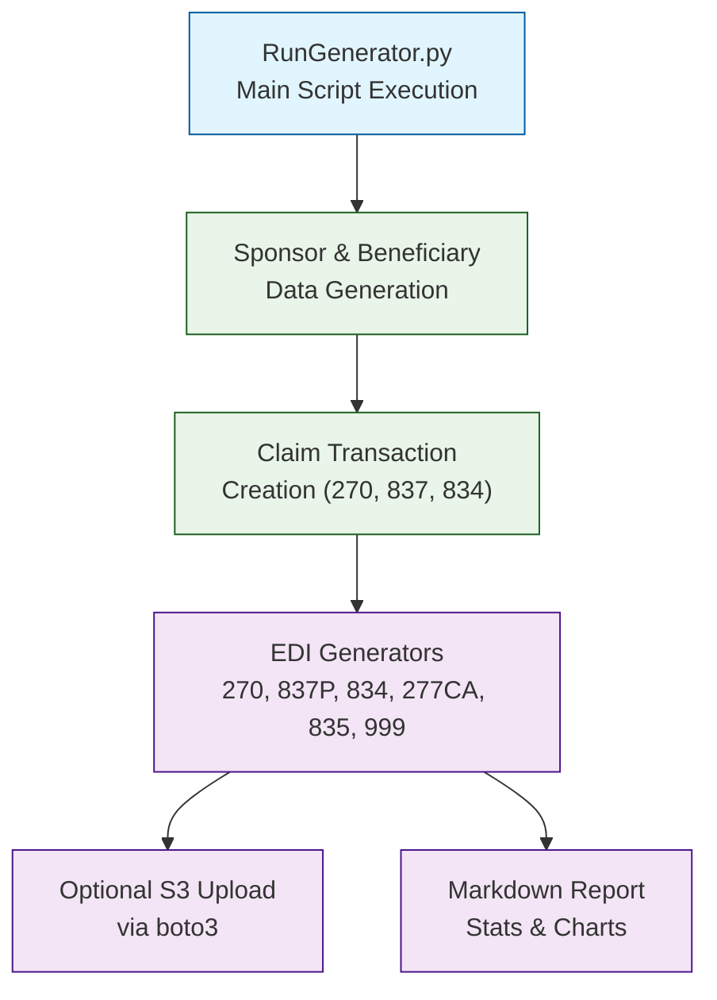

# EDI X12 Healthcare File Generator Suite

## Architecture



---

## Setup

### Prerequisites

- Python 3.12+
- [Poetry](https://python-poetry.org/docs/#installation)

### Installation

1. Clone the repository:

    ```bash
    git clone https://github.com/dhagan-va/intern-2025.git
    cd test-tools/DataGen
    ```

2. Create and start a virtual environment

   ```bash
   python -m venv .venv
   source .venv/bin/activate  # On Windows: .venv\Scripts\activate
   ```
   
3. Install dependencies with poetry

   ```bash
   pip install poetry
   poetry install
   ```

---

## Running the Generator

To run the full EDI file generation pipeline:

```bash
cd src
python RunGenerator.py
```

This performs the following:

- Creates sponsors and beneficiaries (if under threshold)
- Creates claim transactions in 5 states:
  - `Created` (for 270)
  - `270 Created` (for 837P)
  - `837 Created` (for 277CA)
  - `277CA Created` (for 835)
  - `835 Created` (for 834)
- Produces EDI files:
  - ✅ 270 (Eligibility Inquiry)
  - ✅ 837P (Professional Claim)
  - ✅ 277CA (Claim Acknowledgment)
  - ✅ 835 (Payment Remittance)
  - ✅ 834 (Enrollment Update)
  - 🔜 999 (Implementation Acknowledgment)
- Optionally uploads files to AWS S3
- Generates a Markdown summary: `Statistics_Visualizer.md`

---

## Configuration

Edit `Config/config.toml` to adjust:

| Section         | Field                   | Description                      |
|-----------------|-------------------------|----------------------------------|
| `[seed]`        | `random_seed`           | Alter the seed                   |
| `[aws]`         | `upload_to_s3`          | Enable/disable S3 upload         |
| `[database]`    | `backend`               | Choose `sqlite` or `jsonl`       |
| `[constants]`   | `sender_id`, `payer_id` | Required identifiers             |
| `[paths]`       | `edi*_path`             | Output folders for EDI files     |
| `[test_size.*]` | `avg`, `min`, `max`     | Bell curve message distributions |

---

## Output Structure

| File Type | Directory                | Description                             |
|-----------|--------------------------|-----------------------------------------|
| 270       | `Output/EDI270_Output/`  | Eligibility Inquiry                     |
| 837P      | `Output/EDI837_Output/`  | Professional Claims                     |
| 277CA     | `Output/EDI277CA_Output/`| Claim Acknowledgment                    |
| 835       | `Output/EDI835_Output/`  | Remittance Advice                       |
| 834       | `Output/EDI834_Output/`  | Enrollment Updates                      |
| 999       | `Output/EDI999_Output/`  | Syntax Acknowledgment (coming)          |
| Logs      | `Output/Logs/`           | Execution logging                       |
| Markdown  | `Statistics_Visualizer.md`| Throughput, errors, relationships, etc. |

---

### Error Injection

Set via `config.toml`:
```toml
[constants]
total_error_rate = 0.005 # 0.5%
```
Types include:
- Missing values
- Malformed formats
- Invalid values
- Negative numbers (for amounts)

### Claim Status Flow

```text
Created → 270 Created → 837 Created → 277CA → 835 → 834
```

Each EDI generator updates claim status accordingly for later reuse.

### Database Support

- SQLite -- [SQLite Browser](https://sqlitebrowser.org/)
- JSONL

---

## Example Output

```bash
INFO:Config.Config:Fetching claim transactions with status=835 Created and date=2025-07-03
INFO:Config.Config:Generating EDI file from stored data
INFO:Config.Config:Generated total of 500 transactions
INFO:Config.Config:There were 0 errors
INFO:Config.Config:EDI file generation complete
INFO:Config.Config:File generation took: 0:00:00.135001
INFO:Config.Config:It took 0:00:00.140000 to generate 500 transactions for the 834 file
INFO:Config.Config:It took 0:00:23.599000 to generate the output
```

