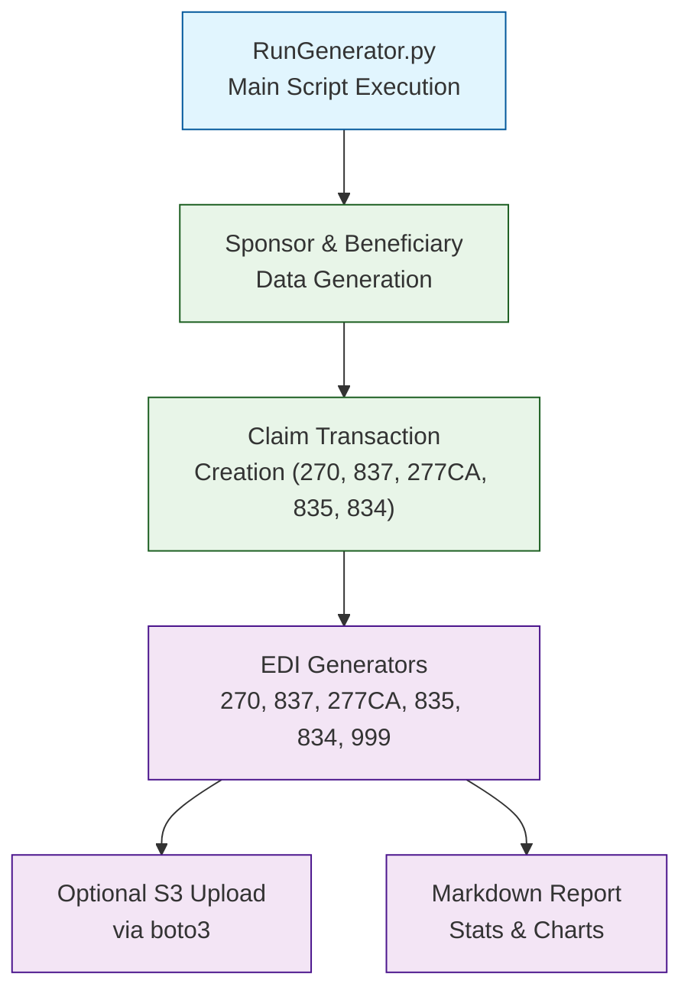
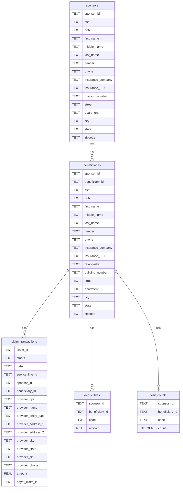

# EDI X12 Healthcare File Generator Suite

## Architecture



## Database ERD



---

## Setup

### Prerequisites

- Python 3.12+
- [Poetry](https://python-poetry.org/docs/#installation)

### Installation

1. Clone the repository:

    ```bash
    git clone https://github.com/dhagan-va/intern-2025.git
    cd test-tools/DataGen
    ```

2. Create and start a virtual environment

   ```bash
   python -m venv .venv
   source .venv/bin/activate  # On Windows: .venv\Scripts\activate
   ```
   
3. Install dependencies with poetry

   ```bash
   pip install poetry
   poetry install
   ```

---

## Initialization and Run Modes

### Output of both modes:
- Generate EDI file(s)
- Generates a Markdown summary: `Statistics_Visualizer.md`

### Initialization Logic

On first execution, the generator will:

- **Check if the database exists and is populated**.
- If **no beneficiaries** are found, it will generate the number set in `config.initial_beneficiaries`.
- If **no claim transactions** are found, it will create an **8-day backlog of transactions** following the standard file flow:

  1. `Created (Day 1)` → 270
  2. `270 Created (Day 2)` → 837
  3. `837 Created (Day 2)` → 277CA
  4. `277CA Created (Day 8)` → 835
  5. `835 Created (Day 8)` → 834

---

### Auto Mode

- Checks for missing sponsors or claims and runs **initialization** if needed.
- On subsequent daily runs:
  - Creates a new `270` transaction for today (if not already made).
  - Sequentially generates all EDI files (270, 837, 277CA, 835, 834) using appropriate transactions and updates their statuses.

This mode is ideal for **daily scheduled runs** or testing the full pipeline behavior.

```bash
cd src
python RunGenerator.py auto # for a random number of messages and error rate which you can alter in config.toml

# Example Usage
python RunGenerator.py auto
```

---

### Manual Mode

- Only creates transactions for the **specified file type**.
- Then generates the corresponding EDI file.

⚠️ If you run only one file type manually (e.g., 837), this may unintentionally generate transactions required for downstream files (e.g., 277CA, 835), which may **cause inconsistencies** in later stages.

Use this mode for **targeted testing or debugging**, not for full-pipeline simulation.

```bash
python RunGenerator.py cli <file_type> -n <count> -e <error_rate> [--upload_s3] # upload_s3 only for 270

# Example Usage
python RunGenerator.py cli 270 -n 500 -e 0.01 --upload_s3
python RunGenerator.py cli 835 -n 500 -e 0.05 
```

---
## Configuration

Edit `Config/config.toml` to adjust:

| Section         | Field                   | Description                      |
|-----------------|-------------------------|----------------------------------|
| `[seed]`        | `random_seed`           | Alter the seed                   |
| `[aws]`         | `upload_to_s3`          | Enable/disable S3 upload         |
| `[database]`    | `backend`               | Choose `sqlite` or `jsonl`       |
| `[constants]`   | `sender_id`, `payer_id` | Required identifiers             |
| `[paths]`       | `edi*_path`             | Output folders for EDI files     |
| `[test_size.*]` | `avg`, `min`, `max`     | Bell curve message distributions |

---

## Output Structure

| File Type | Directory                | Description                             |
|-----------|--------------------------|-----------------------------------------|
| 270       | `Output/EDI270_Output/`  | Eligibility Inquiry                     |
| 837P      | `Output/EDI837_Output/`  | Professional Claims                     |
| 277CA     | `Output/EDI277CA_Output/`| Claim Acknowledgment                    |
| 835       | `Output/EDI835_Output/`  | Remittance Advice                       |
| 834       | `Output/EDI834_Output/`  | Enrollment Updates                      |
| 999       | `Output/EDI999_Output/`  | Syntax Acknowledgment (coming)          |
| Logs      | `Output/Logs/`           | Execution logging                       |
| Markdown  | `Statistics_Visualizer.md`| Throughput, errors, relationships, etc. |

---

### Error Injection

Set via `config.toml`:
```toml
[constants]
total_error_rate = 0.005 # 0.5%
```
Types include:
- Missing values
- Malformed formats
- Invalid values
- Negative numbers (for amounts)

### Database Support

- SQLite -- [SQLite Browser](https://sqlitebrowser.org/)
- JSONL

---

## Example Output

```bash
INFO:Config.Config:Fetching claim transactions with status=835 Created and date=2025-07-03
INFO:Config.Config:Generating EDI file from stored data
INFO:Config.Config:Generated total of 500 transactions
INFO:Config.Config:There were 0 errors
INFO:Config.Config:EDI file generation complete
INFO:Config.Config:File generation took: 0:00:00.135001
INFO:Config.Config:It took 0:00:00.140000 to generate 500 transactions for the 834 file
INFO:Config.Config:It took 0:00:23.599000 to generate the output
```

