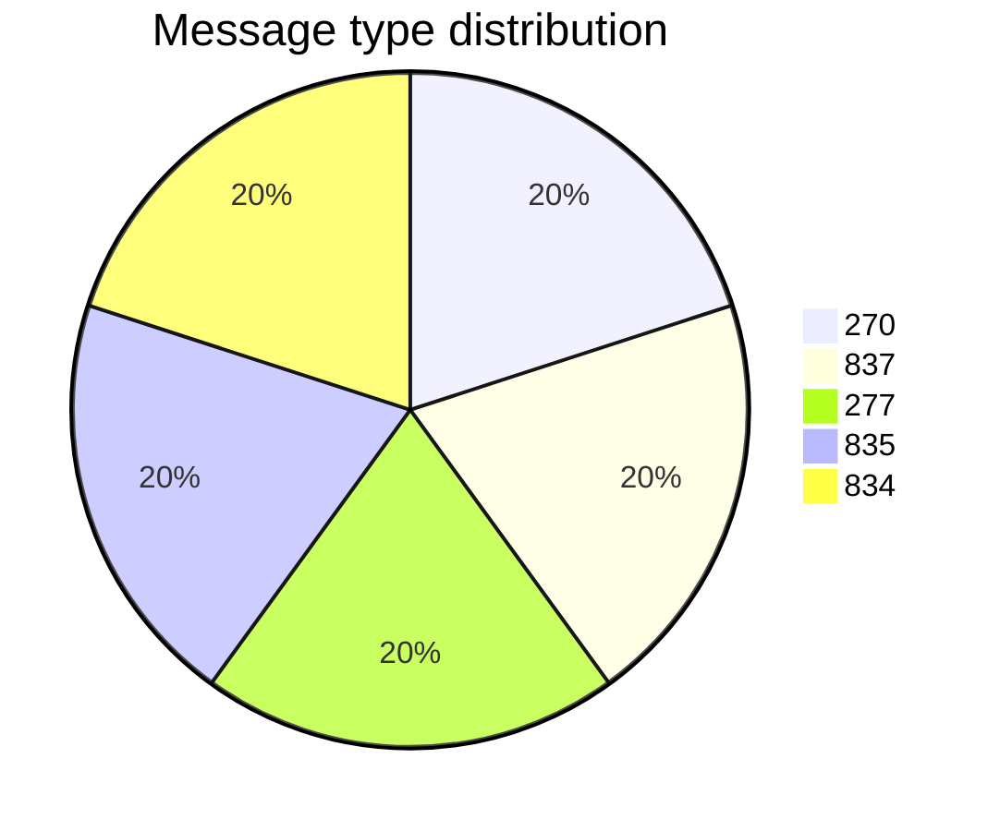
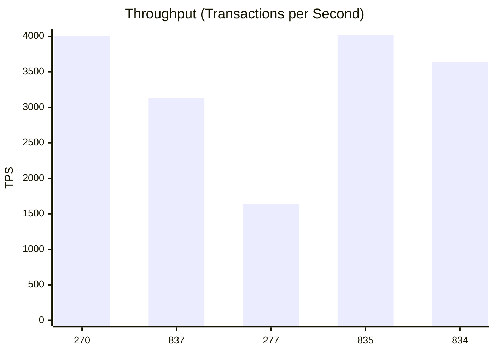
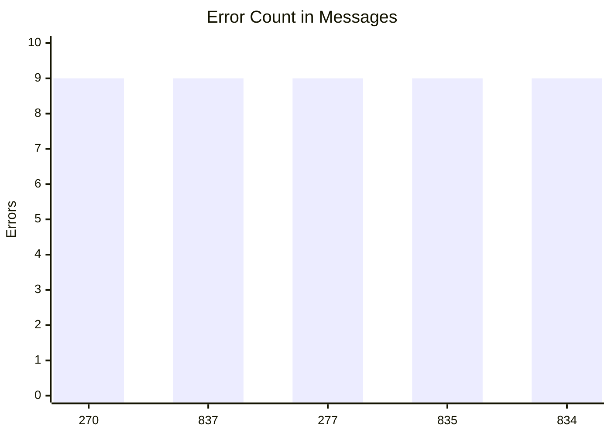
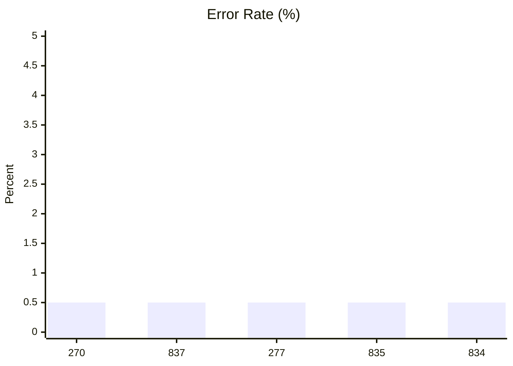
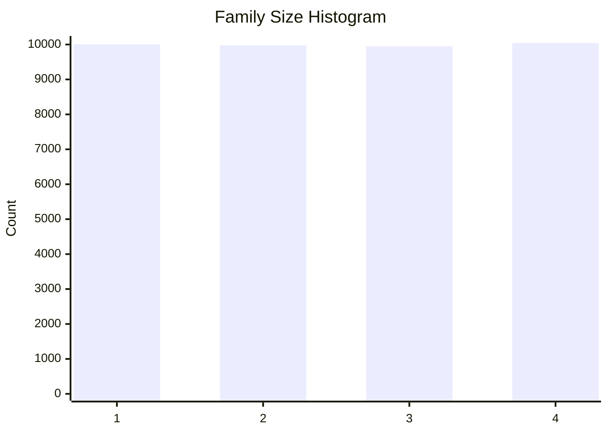
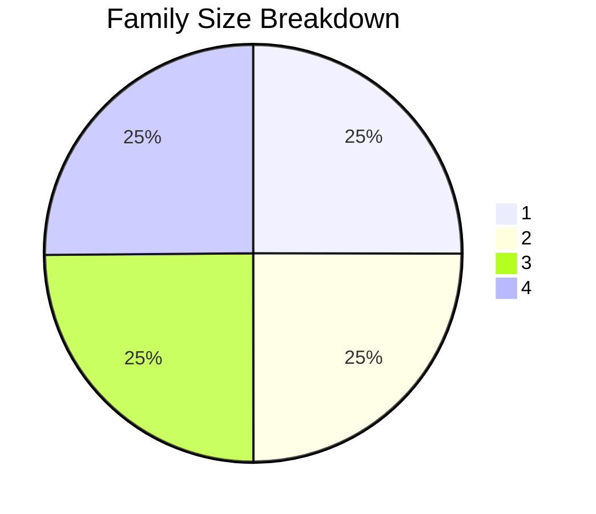
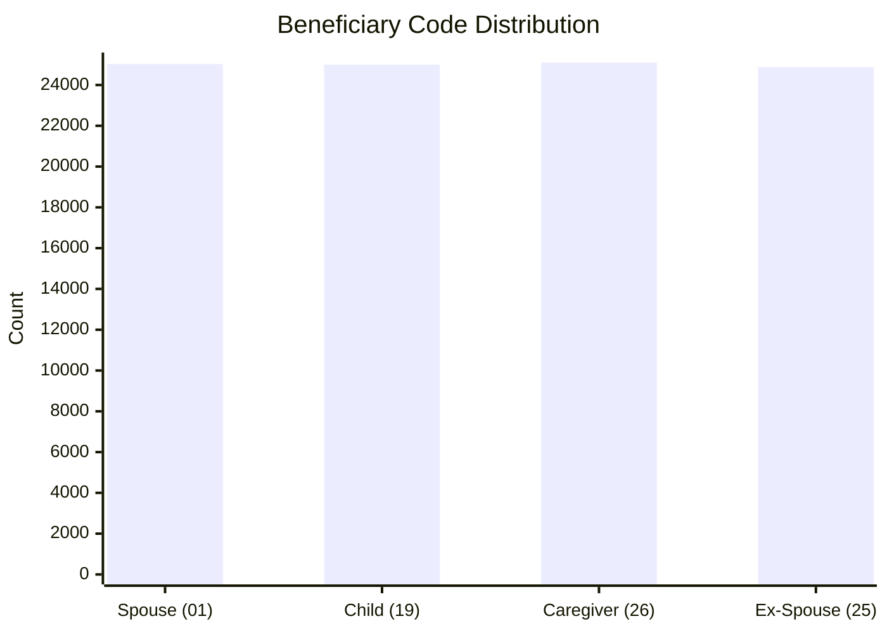
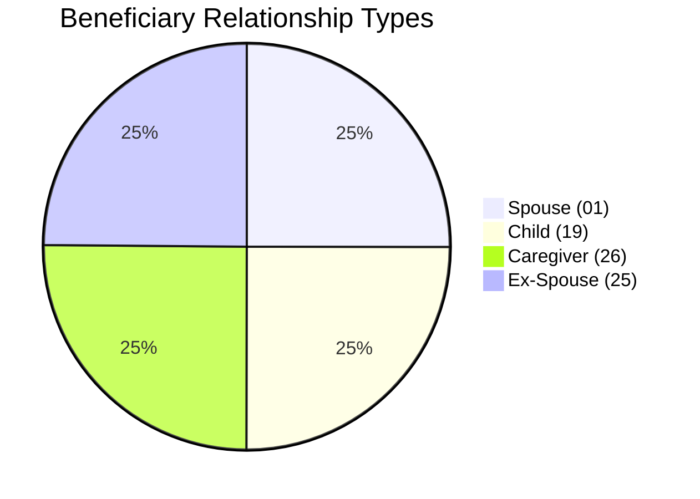
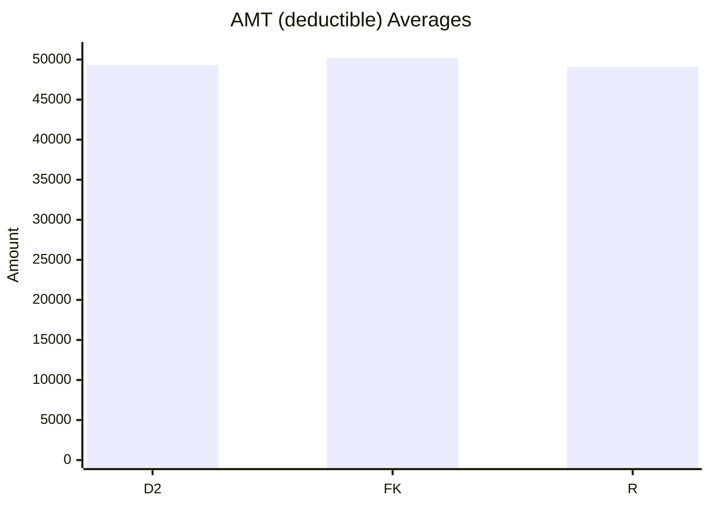
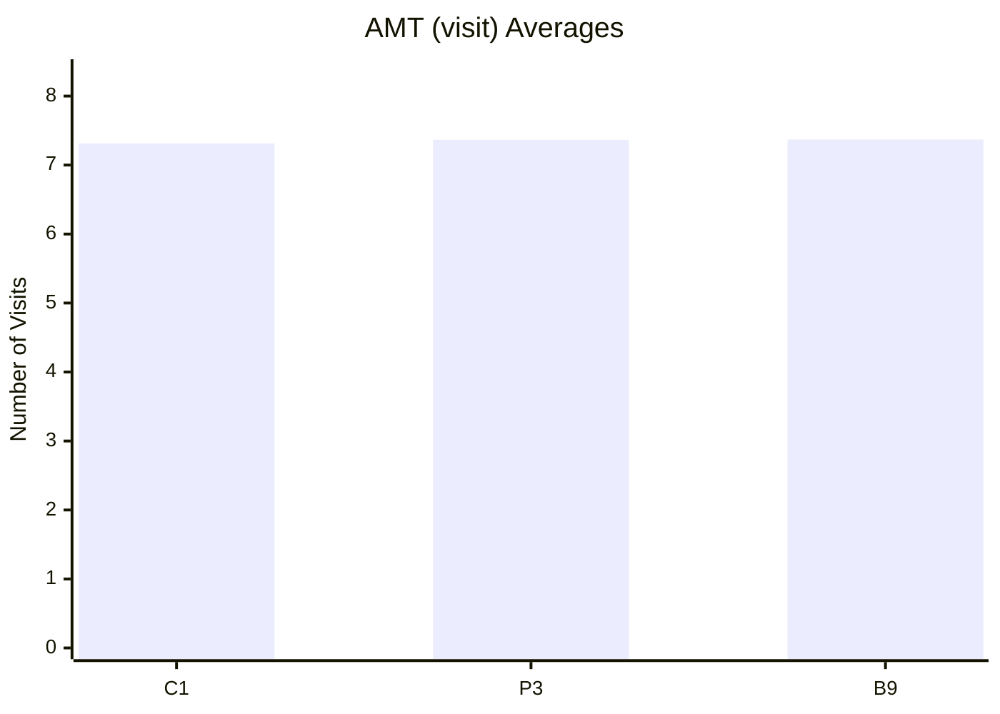

# Data Visualizer 

## What Are 834 and 270 EDI Files?

**EDI 834 - Benefit Enrollment and Maintenance**  
The 834 file is used to electronically transmit enrollment data between employers, insurance providers, and government agencies. It includes information about plan members (sponsors and beneficiaries), such as:
- Enrollment or termination status (in our case it's enrollment)
- Subscriber and dependent details
- Coverage effective dates

**EDI 270 - Eligibility Inquiry**  
The 270 file is used to request information about a member's health insurance eligibility and benefits. It is typically sent by healthcare providers to insurers to confirm:
- Active coverage
- Service eligibility
- Co-pays, deductibles, or benefit limits

## Transaction Counts

Total Number of Messages Generated: **8980**
## Throughput

## Error Count

## Error Rate

## Family Size Distribution

## Beneficiary Types

## AMT (deductible) Averages

## AMT (visit) Averages

## Average 270s per Beneficiary
- Average 270s per Beneficiary: **0.02**
