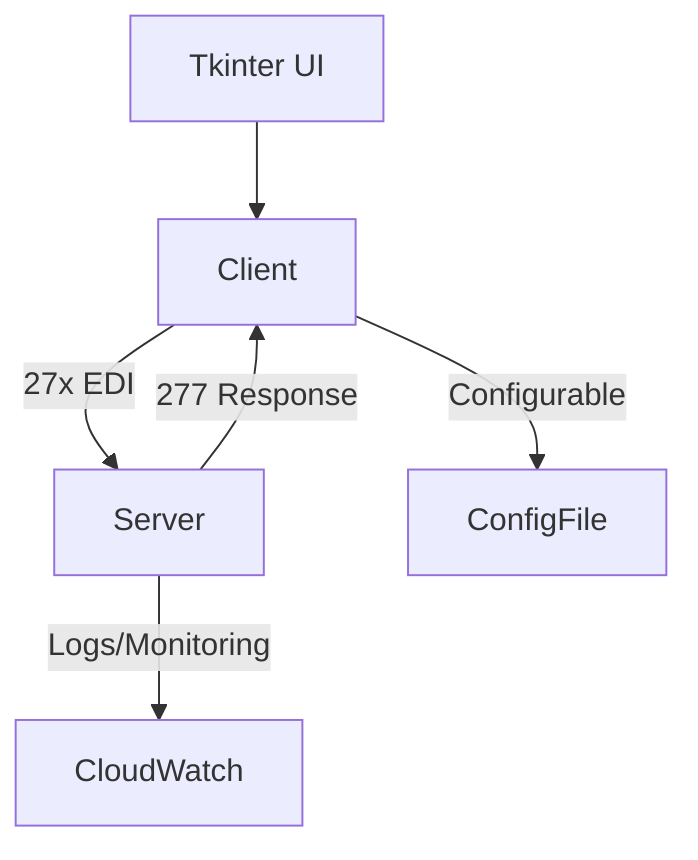

# EDI X12 27x Multi-Threaded Client & Mock Server Test Tool

## Overview

This project delivers a robust, configurable, and multi-threaded EDI X12 270/276 client test tool, capable of uploading generated 27x files. It includes a mock HTTP server (277 response) for end-to-end testing. The tool is designed for extensibility, maintainability, and operational excellence, following industry-leading SDLC, DevOps, and Python best practices.

---

## Features

- **Configurable File-Driven Operation:** All parameters (RPS, concurrency, endpoints, etc.) are file-configurable.
- **Real-Time Control:** Adjust requests per second and concurrent connections on the fly.
- **TLS 1.2+ Support:** Secure communication by default.
- **Multi-Threaded Architecture:** Efficient, scalable client and server.
- **Tkinter UI:** Intuitive interface for configuration and monitoring.
- **Mock HTTP Server:** Simulates 277 responses for comprehensive testing.
- **DRY & SOLID Principles:** Clean, maintainable, and extensible codebase.
- **Comprehensive Unit Tests:** All logic is covered with mocks and CI-enforced coverage.
- **Mermaid.js Diagrams:** Architecture and flow documented in Markdown.
- **GitHub Wiki:** In-depth documentation, setup, and troubleshooting.
- **Python Coding Standards:** PEP8, type hints, docstrings, and linting enforced.
- **DevOps Ready:** CI/CD pipelines, IaC for AWS deployment, and automated testing.
- **Cloud Deployment:** Deploy mock server to AWS API Gateway + Lambda (CloudFormation/CodeBuild scripts included).
- **Go Implementation (Extra Credit):** Channel-based concurrency, full test coverage, and static analysis.

---

## SDLC & DevOps Best Practices

- **Version Control:** All code and configs tracked in Git with clear branching strategy (feature, develop, main).
- **Code Reviews:** Mandatory PR reviews with automated linting, type checks, and test runs.
- **Continuous Integration:** GitHub Actions/CodeBuild pipelines for build, test, lint, and coverage.
- **Continuous Deployment:** Automated deployment to AWS (API Gateway + Lambda) with rollback support.
- **Infrastructure as Code:** CloudFormation templates for reproducible cloud environments.
- **Secrets Management:** No secrets in code; use AWS Secrets Manager or environment variables.
- **Observability:** Logging, metrics, and error tracking integrated (CloudWatch, Sentry, etc.).
- **Documentation:** Auto-generated API docs (Sphinx), architecture diagrams (Mermaid.js), and usage guides.
- **Testing:** 
  - Unit, integration, and end-to-end tests.
  - Mocking for external dependencies.
  - 90%+ code coverage enforced.
  - Test data and scenarios versioned.
- **Security:** 
  - Static analysis (bandit, safety).
  - Dependency scanning.
  - TLS everywhere.
  - Principle of least privilege for AWS roles.
- **Python Best Practices:**
  - PEP8, PEP257, and Google-style docstrings.
  - Type hints and mypy checks.
  - Virtual environments (venv/poetry).
  - Dependency pinning (`requirements.txt`/`poetry.lock`).
  - Modular, reusable code structure.
  - Exception handling and graceful error recovery.
- **Release Management:** Semantic versioning, changelogs, and tagged releases.
- **Containerization:** Docker support for local and CI/CD environments.

---

## Getting Started

1. **Clone the Repository**
2. **Install Dependencies**
   ```sh
   python -m venv venv
   source venv/bin/activate  # or venv\Scripts\activate on Windows
   pip install -r requirements.txt
   ```
3. **Run Unit Tests**
   ```sh
   pytest --cov=src
   ```
4. **Start the Client/Server**
   ```sh
   python src/client.py --config config/client.yaml
   python src/server.py --config config/server.yaml
   ```
5. **Launch the UI**
   ```sh
   python src/ui.py
   ```

---

## Architecture



---

## Python Coding Standards

- [PEP8 – Style Guide for Python Code](https://peps.python.org/pep-0008/)
- [Google Python Style Guide](https://google.github.io/styleguide/pyguide.html)
- [PEP257 – Docstring Conventions](https://peps.python.org/pep-0257/)

---

## AWS Deployment

- **API Gateway + Lambda:** Deploy mock server for internet-facing testing.
- **CloudFormation:** Scripts in `deploy/` for reproducible infrastructure.
- **CodeBuild:** CI/CD pipeline for automated deployment.

---

## Go Implementation (Extra Credit)

- Channel-based concurrency.
- Full unit test coverage (`go test -cover`).
- Static analysis (`go vet`, `errcheck`).

---

## Contributing

- Fork, branch, and submit PRs with clear descriptions.
- All code must include unit tests and documentation.
- Follow the [Contributor Guide](./CONTRIBUTING.md).

---

## References

- [EDI X12 270/276/277 Standards](https://x12.org/)
- [Python Official Documentation](https://docs.python.org/3/)
- [Tkinter Documentation](https://docs.python.org/3/library/tkinter.html)

---

## Access & Support

- Request TRM access as needed.
- For issues, open a GitHub Issue or contact the maintainers.

---