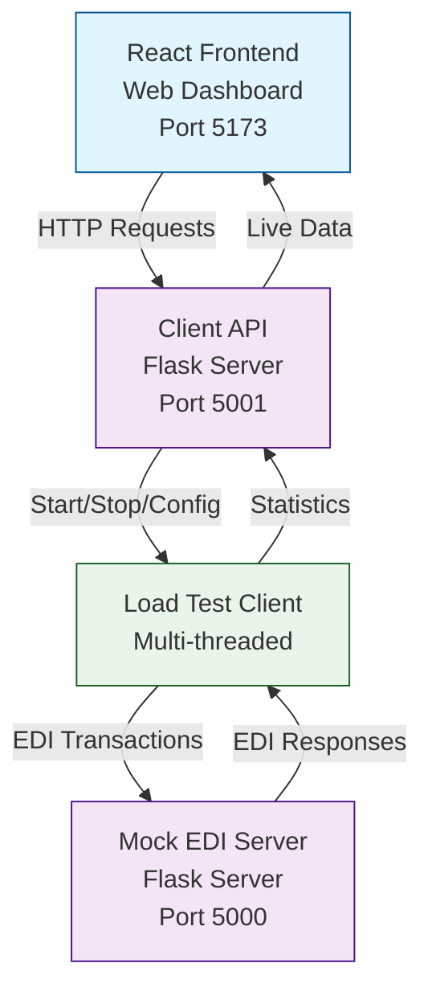

# EDI X12 27x Multi-Threaded Client & Mock Server Test Tool

## Architecture



## Setup

### Prerequisites
- Python 3.8+
- Node.js 16+ (for frontend)
- Poetry (Python package manager)

### Installation
1. Clone the repository
   ```bash
   git clone https://github.com/dhagan-va/intern-2025.git
   ```
2. Navigate to test-tools/edi-test-client
   ```bash
   cd test-tools/edi-test-client
   ```
3. Create and start a virtual environment
   ```bash
   python -m venv .venv
   source .venv/bin/activate  # On Windows: .venv\Scripts\activate
   ```
4. Install dependencies with poetry
   ```bash
   pip install poetry
   poetry install
   ```

### Frontend Setup
5. Navigate to frontend directory
   ```bash
   cd frontend
   ```
6. Install frontend dependencies
   ```bash
   npm install
   ```
7. Start the frontend development server
   ```bash
   npm run dev
   ```

### Running the Application
8. Start mock Flask server (in new terminal)
   ```bash
   cd test-tools/edi-test-client
   source .venv/bin/activate
   ./runserver.sh
   ```
9. Start the API backend (in new terminal)
   ```bash
   cd test-tools/edi-test-client
   source .venv/bin/activate
   python backend/src/client_api/api.py
   ```
10. Access the web dashboard at `http://localhost:5173`

### Testing
11. Run unit tests
    ```bash
    python -m pytest tests/ -v
    ```
12. Run with coverage
    ```bash
    python -m pytest tests/ --cov=backend/src --cov-report=html
    ```

### Command Line Usage
Alternatively, run the client directly from command line:
```bash
./runclient.sh
```

### Logs
- Backend logs: `backend/src/client/test.log`
- API logs: `backend/src/client_api/test.log`
- Frontend logs: Browser console

## Usage

1. **Web Dashboard**: Access `http://localhost:5173` for the React frontend
2. **Mock Server**: Runs on `http://localhost:5000`
3. **API Backend**: Runs on `http://localhost:5001`

### Configuration
- Default settings: `backend/src/conf/default.toml`
- Modify RPS, transaction types, and endpoints through the web interface