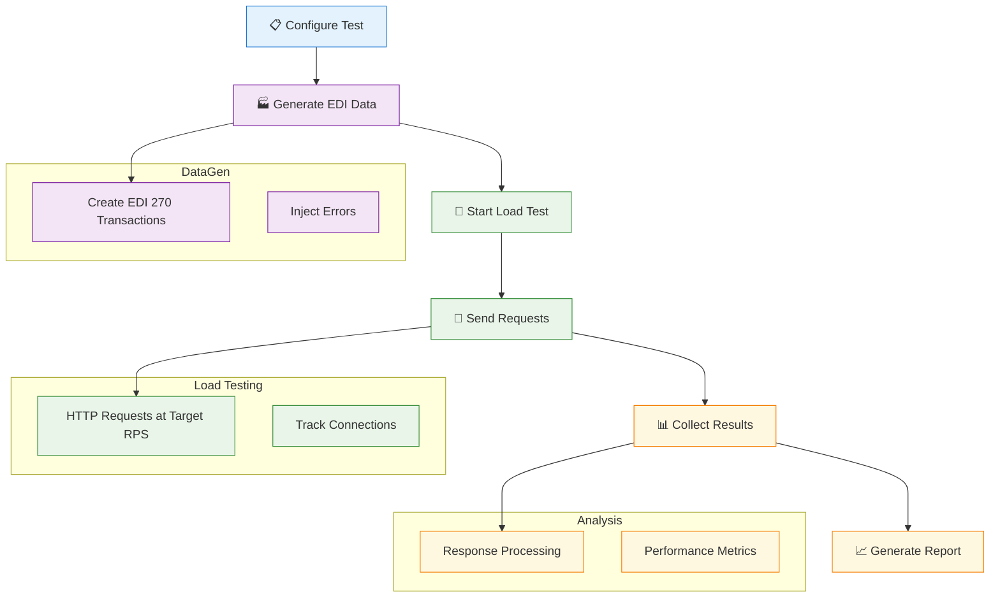
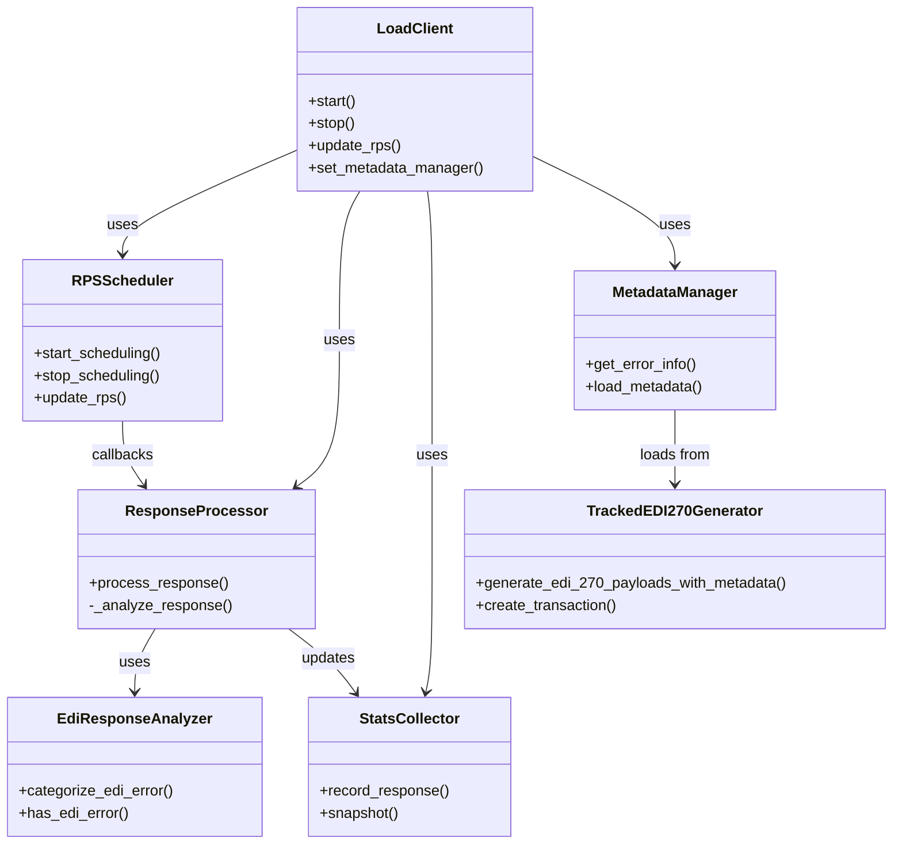

# EDI X12 27x Multi-Threaded Client & Mock Server Test Tool

## Overview

This tool provides comprehensive EDI X12 load testing with dynamic payload generation and error injection. It integrates with the DataGen module to create realistic EDI 270 transactions and tracks them using ST control numbers for production-compatible testing.

## Test Client Workflow



## Architecture



## Setup

### Prerequisites
- Python 3.8+
- Poetry (Python package manager)

### Installation
1. Clone the repository
   ```bash
   git clone https://github.com/dhagan-va/intern-2025.git
   ```
2. Navigate to test-tools/edi-test-client
   ```bash
   cd test-tools/edi-test-client
   ```
3. Create and start a virtual environment
   ```bash
   python -m venv .venv
   source .venv/bin/activate  # On Windows: .venv\Scripts\activate
   ```
4. Install dependencies with poetry
   ```bash
   pip install poetry
   poetry install
   ```

## Usage

### EDI Metadata Load Testing

Run EDI 270 metadata load tests with dynamic payload generation and error injection:


### Command Options
- `--transactions, -t`: Number of EDI transactions to generate and send (default: 10)
- `--rps, -r`: Requests per second rate (default: 5.0)
- `--error-rate, -e`: Error injection rate from 0.0 to 1.0 (default: 0.1)
- `--preset`: Use predefined configurations (`quick` or `stress`)
- `--output-metadata`: Save complete test results to JSON file
- `--verbose, -v`: Show detailed transaction information


### Starting the Mock Server

Before running the metadata load test, start the mock EDI server:

```bash
# In a separate terminal
./runserver.sh
```

The mock server will start on `http://localhost:5000` and handle EDI 270 requests.